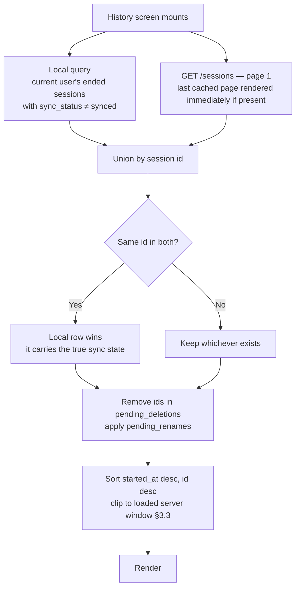
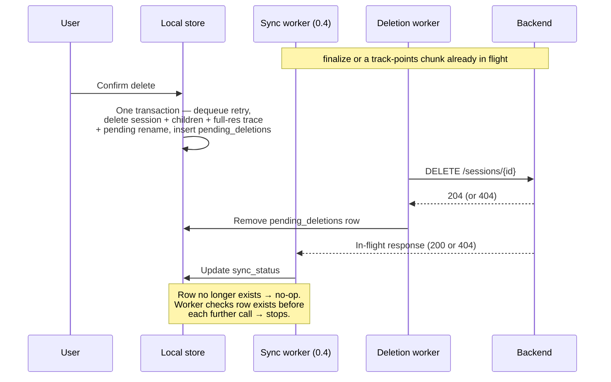
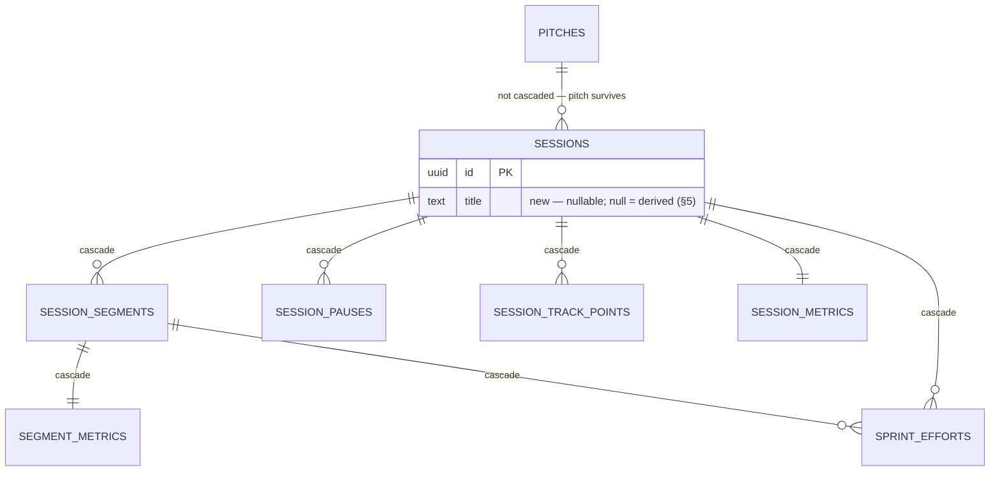
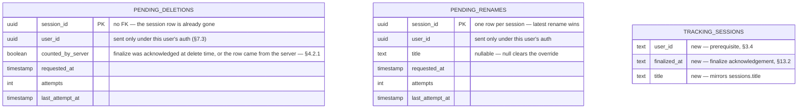
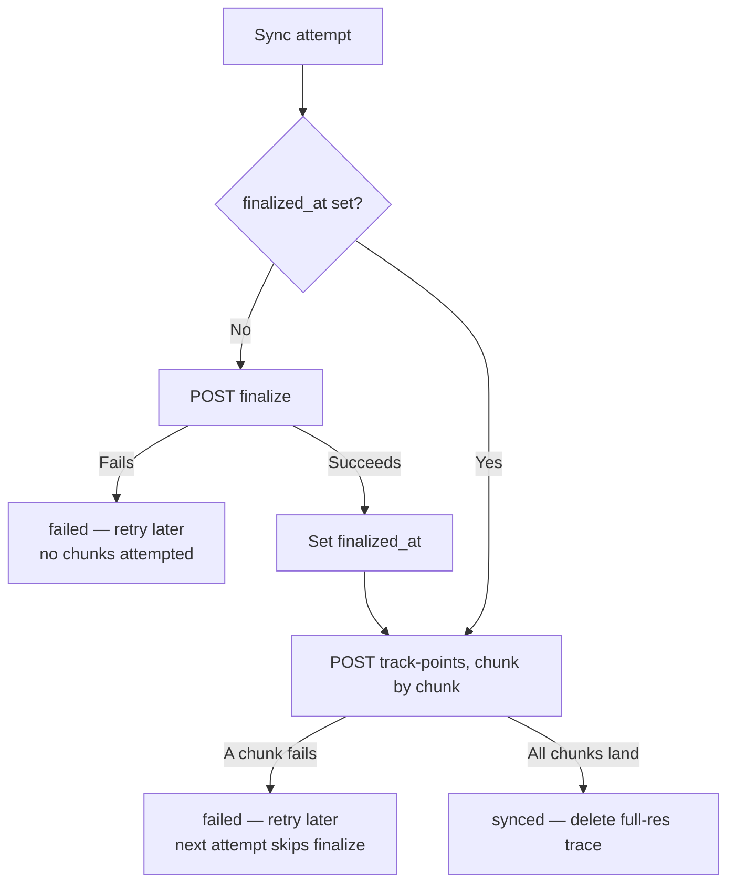

# Eleven — Session History System Design Spec (Feature 0.6)

**Status:** Draft v3
**Milestone:** M0
**Feature:** 0.6 — Session history
**Depends on:** 0.3 (session setup), 0.4 (GPS tracking & sync), 0.5 (post-session summary)
**Contains amendments to:** 0.3 **[0.3]**, 0.4 **[0.4 correction]**, 0.5 **[0.5 correction]**
**v2 changes:** aligned to the history UI already in the app. Session titles are derived, and renaming is the one permitted edit (§5). The current-month grid has its own endpoint (§4.2.2). A session count is shown, and §8 is narrowed from "no aggregates" to "no metric aggregates". Rows display distance and top speed only, with duration still in the payload (§4.4). List month headers are dropped (§4.2). Design states to mock are listed (§12). §3.3 is reworded around the one case it guards.
**v3 changes:** title rule is `{Weekday} {Part of day} {Type}` (§5.1). Tapping a filled grid day scrolls the list to it (§4.2.3). The local-schema and sync-worker assumptions were checked against the mobile codebase: the local table has no `user_id` and no `finalize` acknowledgement, and both are now requirements (§3.4, §13.2). §2 is corrected — the server keeps no sync state. `finalized_at` also makes sync resumable after `finalize`, matching 0.4 §8's intent (§13.2). Eligibility is now "the session has ended", not "metrics exist": sessions finalized without metrics are listed with a no-stats row, for backwards compatibility (§2, §4.5.2).

---

## 1. Scope

0.5 produces one session's numbers once, at the moment it ends. 0.6 is where those sessions **accumulate**: every past session, listed, filterable, and tappable back into its own summary. It is the PRD's "reason to come back".

**This spec owns:**
- What counts as a history entry, and what does not (§2)
- Merging the two places a session can live — the server, and the device while unsynced — into one list (§3)
- The history screen: ordering, session count, current-month grid, filtering, row content, sync-state and data-quality presentation, empty states (§4)
- Session titles — the derivation rule, and renaming (§5)
- Session detail as a destination from history, reusing 0.5's summary screen (§6)
- Session deletion across every sync state, including the local outboxes and their races with 0.4's sync worker (§7)
- The M0 answer to 0.5 §4.4's flagged question on cross-session sprint aggregates (§8)
- The read, rename, and delete endpoints, and the index behind the load-time target (§9, §10)
- The design states the history mockup must cover (§12)

**This spec does not own:**
- Computing any metric, or the rules for suppressing or flagging one (0.5 §3, §5). 0.6 renders what 0.5 stored, under 0.5's rules
- Sync, retry, and the `finalize` / `track-points` transport (0.4 §8, §9; 0.5 §7.3.5)
- Weekly rollups and week-over-week comparison (0.7)
- Share cards (0.8)

**Explicitly out of scope for M0:**

| Item | Why |
|---|---|
| Editing anything about a past session other than its title | PRD forbids editing tracked metrics. Metadata is locked too; see §7.6 |
| Metric totals of any kind on the history screen | Aggregation is 0.7's. Sprint aggregates are refused outright in M0 (§8) |
| Grid months other than the current one | The grid always shows the current month (§4.2.2) |
| Undo after delete | Confirmation is the PRD's bar; see §7.5 |
| Search, date-range filters, sort options other than newest-first | Nothing in the PRD asks for them, and 50–200 sessions scroll comfortably |

---

## 2. What counts as a history entry

A session enters history when it has **ended**. That is the only condition, and it holds on both sides of the wire. Whether it has numbers decides how its row looks, not whether it is listed.

| Session state | In history? | Why |
|---|---|---|
| Created at setup (0.3 `POST /sessions`), never kicked off | **No** | Nothing was played. `started_at` and `ended_at` are null |
| Kicked off, tracking live | **No** | Not over. The active-session screen owns it |
| Ended on this device, any `sync_status` | **Yes** | Metrics are computed before sync starts (0.5 §2), so the session is complete from the player's point of view the moment the summary renders |
| Ended elsewhere, `finalize` received by the server | **Yes** | `finalize` sets `ended_at` and carries the metrics payload (0.5 §9) |
| `data_quality = insufficient` | **Yes** | 0.5 §5.2: the session is stored and should be seen to exist. Row treatment in §4.5.1 |
| Finalized **without** metrics | **Yes** | Backwards compatibility — see below. Row treatment in §4.5.2 |
| Kicked off on the server, never finalized, not on this device | **No** | An orphan — the device that recorded it was wiped, lost, or signed out before sync. No `ended_at`, so nothing says it finished. See §16 |

**On the server, eligibility is `sessions.ended_at IS NOT NULL`.** The server keeps no sync state: `sync_status` is client-local, and `ended_at` is the server's only finalize marker (0.4 §7.1). `session_metrics` is **left-joined**: present, the row shows numbers; absent, it shows the no-stats treatment. **On the device**, eligibility is `tracking_sessions.ended_at IS NOT NULL`, with local metrics left-joined the same way.

**Why sessions without metrics are listed.** `finalize` accepts the metrics as optional, so a session can reach the server with `ended_at` set and no `session_metrics` row. That has happened for sessions recorded before 0.5's computation shipped. These are being cleared by hand, and with 0.5 in place the state isn't expected to recur: End Session computes and stores metrics before it starts sync. History still lists them, for backwards compatibility. A session that ended is a session the player played, and hiding one because its numbers are missing would make history disagree with the player's memory. The rule costs one left join instead of an inner join.

When metrics are sent, `finalize` must write `ended_at`, `session_metrics`, `segment_metrics`, and `sprint_efforts` in **one transaction**, which §13.2 states as an invariant. A session is then either complete with numbers or complete without them — never visible with some of its metrics.

The same eligibility rule governs the list, the session count, and the month grid. Anything in one is in the other two.

---

## 3. Two sources, one list

### 3.1 Where sessions live

Because of local-first sync (0.4 §9), a finished session can be in one of two places:

- **On the server** — every session whose `finalize` has landed, from any device the player has used.
- **Only on this device** — every session this device ended whose `finalize` has not landed: `pending`, `syncing` (before `finalize` completes), `failed`, and `rejected`.

Neither source is complete on its own. The server is missing whatever this phone hasn't uploaded — which is usually the session the player *just* finished, the one they are most likely to go looking for. The device is missing everything recorded before a reinstall and everything from another phone.

**Decision: the server is the source for synced sessions; the device is the source for unsynced ones. The list is their merge.** The count and the grid merge the same two sources (§4.2).



### 3.2 Precedence and de-duplication

A session id is shared by both sides from the start — it is issued by 0.3's `POST /sessions`, before kickoff. So de-duplication is by id, with one rule:

**If a local row exists and its `sync_status` is not `synced`, the local row is displayed.** This matters in the window after `finalize` succeeds but while `track-points` chunks are still uploading: the server already returns the session, but the device still knows it is `syncing`. Showing the server's copy there would hide a true fact about the session.

Once the local row reaches `synced`, it leaves the local source entirely and the server row takes over. The metrics are identical — both are the same immutable values (0.5 §2) — so the handover is invisible apart from the sync indicator disappearing.

**The sync worker signals the history screen when a session changes state.** Any `sync_status` transition, and the acknowledgement of `finalize` (§4.2.1), invalidates the history queries. A row flips from "Uploading…" to normal, and the count stays right, without the player leaving the screen.

### 3.3 Merging with a paginated server list

The server list is paginated (§10); the local list is not. Because `finalize` carries the metrics and is the call that lands first (0.4 §8), a session stays local-only only while its `finalize` hasn't landed:

| Local-only case | Can it be old? |
|---|---|
| `pending`, or `syncing` before `finalize` lands | No — seconds, and it is the newest session |
| `failed` while offline | No — nothing recorded after it can have synced either, so it stays the newest |
| `rejected` at `finalize` | **Yes** — nothing retries, so it can sit on the device for weeks |
| `rejected` at `track-points`, after `finalize` succeeded | Not local-only — the server has it, and §3.2's de-duplication covers it |

The only row that needs handling is an old `finalize`-rejected session. Sorting the merged set always keeps the rows in the right order. The problem is stability: such a row sorts to the bottom of the loaded window, and when the next server page arrives, newer rows insert above it, so the row jumps down the list while the player is scrolling.

**Rule:** a local row is rendered only if its `started_at` is at or after the oldest `started_at` in the server rows loaded so far, or once the server has returned its last page. The row appears when pagination reaches its position and never moves after that. It is one comparison in the merge, and the server doesn't need to know anything about the device.

### 3.4 Scoped to the signed-in user

Every local query — sessions, `pending_deletions`, `pending_renames` — must filter by the **current user's id**. A phone signed out of one account and into another still holds the first account's unsynced sessions and queued changes, and they must not appear in, or be sent from, the second account.

**Checked against the mobile codebase: the local `tracking_sessions` table has no `user_id`.** Rows are seeded from the kickoff response without recording whose session it is, and `getSessionsPendingSync` selects every ended, unsynced session on the device. So adding `user_id` is a **prerequisite for 0.6**, not an assumption:

- **Column:** `tracking_sessions.user_id`, written at seed time from the `user_id` already present on the kickoff response (`SessionRead.user_id`).
- **Backfill:** rows written before the column existed are assigned to the user signed in when the migration runs. Almost every phone has had one account, and a row that can't be attributed would otherwise be invisible forever.
- **Every local read is scoped by it:** history, the count, the grid, and 0.4's sync queue (§13.2).

The sync queue's current behaviour is a live bug, not just a gap — see §13.2.

### 3.5 Offline

The history screen never shows a full-screen error when it has anything to show.

- Local unsynced rows render regardless of connectivity.
- The last successfully fetched server pages render from cache.
- If the server can't be reached and there is no cache, local rows render with an inline notice at the bottom — "Couldn't load older sessions" with a retry — instead of an error state that hides them.

The cache here is the client's query cache, **held in memory only**. The backend caches nothing for history (§10). Cached pages survive moving between screens but not an app restart. After a cold start, the first load always goes to the network, and offline the screen shows only local unsynced rows. That is enough for M0, because the session a player most wants offline — the one they just finished — is always local. §11's load target is measured on a cold cache, so it doesn't depend on persistence either. Persisting the cache would also mean clearing it on sign-out, for the same reason as §3.4.

### 3.6 Considered and rejected: a full local mirror

The alternative was to mirror every session's list row into the device's SQLite and read history entirely from local storage, syncing the mirror from the server in the background.

That makes offline history complete, but it builds a second replication path next to 0.4's sync — one that runs the other way, has its own conflict and deletion propagation rules, and has to be correct on first install and after reinstall. The gain is offline access to sessions older than the cache, which is a small gain for a player standing on a pitch who mostly wants the session they just played. That session is always local anyway. Rejected for M0.

---

## 4. The history screen

Top to bottom: title and session count, type filter, current-month grid, session list, tab bar.

### 4.1 Ordering

**Newest first, by `started_at` — the time the session was played.** The tie-breaker is `id`, so ordering is total and keyset pagination is stable.

The alternatives were `created_at`, which is when setup began and can be minutes or hours earlier, and `ended_at`, which reorders sessions by when they stopped rather than when they happened. `started_at` matches what "the date of a session" means to a player.

### 4.2 Session count and month grid

The list itself has **no month section headers**. The grid gives the screen its sense of time, and each row carries its own date (§4.4).

#### 4.2.1 Session count

"23 SESSIONS" in the header: **the number of history entries matching the current type filter, all-time.** It is the only cross-session figure on the screen, and it counts sessions, not any metric (§8).

- **Server part:** `total_count` returned with the first page of `GET /sessions` (§10) — the same eligibility join and filter as the list, counted once per fetch, not per page.
- **Local part:** local sessions whose `finalize` has **not been acknowledged**. Those are the ones the server cannot be counting yet. Counting by `sync_status` would double-count a `syncing` session whose `finalize` has already landed. This requires the device to record the `finalize` acknowledgement (§13.2).
- **Pending deletions:** subtract those the server is still counting — the ones marked `counted_by_server` (§9.2). Without this, deleting a session offline would leave the count unchanged, which reads as the delete not having worked.

**Count = `total_count` + unacknowledged local sessions − pending deletions counted by the server.** "1 SESSION" in the singular.

#### 4.2.2 Month grid

One cell per day of the **current month** in the device's local time. A day is filled if at least one history entry was **played** on it — the local date of `started_at`. The month label above it reads "SEPTEMBER 2026".

- **Its own data, not the list's.** The list is paginated at 20, and a busy month can hold more sessions than the first page — 23 in the mockup. A grid built from loaded rows would silently miss days. It reads from `GET /sessions/calendar` (§10).
- **The response carries session ids per day**, not just dates. The client merges the server's days with local unsynced sessions by id, and subtracts ids in `pending_deletions`, so a day becomes empty the moment its only session is deleted — even offline. Union by id also means a session cannot fill a cell twice.
- **Day bucketing is done on the server, in the client's timezone.** The client sends its IANA timezone. The server converts `started_at` to a local date in that zone. A session that kicks off at 23:30 falls on the day the player remembers it on, not the UTC day.
- **The type filter applies to the grid** as it does to the list and the count. Futsal selected shows futsal days.
- **`insufficient` and every unsynced state fill a cell.** The session was played; the grid shows when, not how well.
- **Tapping a filled day scrolls the list to it** (§4.2.3).
- **It always shows the current month**, so on the first of a month it is nearly empty, however busy last month was. That is correct behaviour, and it needs a designed state (§12).

#### 4.2.3 Tapping a day

Tapping a filled cell scrolls the list to **the newest session played that day** and briefly highlights it. Empty days and future days do nothing.

The target may not be loaded yet: the current month can hold more sessions than one page, 23 in the mockup against a page size of 20. The grid response already carries that day's session ids (§4.2.2), so the client knows exactly what it is looking for:

1. If the target session is already in the loaded list, scroll to it.
2. Otherwise, load the next server pages until the oldest loaded `started_at` is earlier than the start of that day, then scroll. Because the grid only ever shows the current month, this is at most a page or two.
3. While pages load, the tapped cell shows a pressed state, and the list doesn't jump until the target is ready.

The type filter can't strand a tap: the grid and the list share the filter (§4.3), so every filled cell has at least one matching row. Local unsynced sessions are found the same way, since §3.3's window rule releases them as pagination reaches their day.

The tap only moves the list. It doesn't filter the list to that day or open the session.

**Travel caveat.** Grid days, row dates, and derived titles (§5.1) all use the device's *current* timezone, because no session stores the timezone it was played in. A session played in Lagos and viewed from London can move a day or change its weekday name. That is accepted for M0, and it is consistent: all three shift together.

### 4.3 Filtering by type

A single-select control with four options: **All · Match · Training · Futsal**. These map one-to-one to `session_type` (0.3 §5).

- The filter applies to **the list, the count, and the grid** together, as a query parameter on all three server reads (§10), with the same predicate on the local source.
- It is screen state, not persisted. Leaving history and returning resets it to All.
- Changing the filter resets pagination.

### 4.4 Row content

The row shows what the in-app design shows: title, a meta line, and two numbers.

| Element | Source | Notes |
|---|---|---|
| Title | §5 | Derived, unless renamed |
| Meta line — date · pitch · type | `started_at`, `pitches.name`, `session_type` | "27 SEP · LEKKI · MATCH". The pitch segment is omitted when `pitch_id` is null. The year is appended only when it isn't the current year ("27 SEP 2025"); without month headers, the row has to disambiguate itself |
| KM | `session_metrics.distance_m` | Formatted exactly as on the summary |
| TOP | `session_metrics.top_speed_kmh` | km/h. Suppressed under `speed_source = none` (0.5 §5.1) |
| Estimated marker | 0.5 §3.9, §5.1 | Per metric, using 0.5's rules |
| Sync line | local `sync_status` | Only on unsynced rows (§4.6) |

**Duration is in the list payload but not on the row.** `active_duration_seconds` comes back with every item (§10), but the row doesn't display it. The player sees it on the detail screen. Keeping it in the payload is free, and it means a later row design can show it without an API change.

**Sprint count is not on the row.** Under 0.5 §4.4, sprint counts are relative to each session's pitch-scaled threshold, and 0.5 requires the threshold to be shown next to any sprint count. A row has no room for "14 sprints above 17 km/h · 7-a-side bands". And a vertical list of bare sprint counts is exactly the setting where a player compares them — twelve on futsal against twelve on a full pitch — as if they measured the same thing. Distance and top speed are comparable across venues without a caption. Sprints, calories, zones, duration, and the per-segment breakdown are one tap away on the detail screen, where 0.5's captions already live.

#### Presentation rules are shared, not re-implemented

0.5 decides when a metric is suppressed and when it is marked `estimated`. 0.6 must never derive those rules again for itself. Both screens call **one client function** that takes a session's metrics and returns, per metric, either a value with an `estimated` flag or `suppressed`. The same applies to number formatting and to the title derivation (§5.1).

If the summary and the history row ever disagree about whether a number is trustworthy, one of them is lying. A single function makes that disagreement impossible rather than unlikely.

### 4.5 Rows without numbers

Two kinds of session are listed but show no KM or TOP. They look similar on a row but mean different things, so their copy differs.

#### 4.5.1 `insufficient` sessions

A row for an `insufficient` session shows its title and meta line like any other, but in place of KM and TOP it shows **"Couldn't track this one properly"** — the same message as 0.5 §5.2, deliberately. Tapping it opens 0.5's `insufficient` state.

It is listed, counted, filled on the grid, and matched by filters, because 0.5 §5.2 requires history to show the session existed. It shows no numbers, because 0.5 §5.2 also refuses to present metrics from unusable signal as measurements — and a row is still a presentation.

#### 4.5.2 Sessions without metrics

A session finalized without metrics (§2) shows its title and meta line like any other. In place of KM and TOP it shows **"No stats for this session"**.

- **Copy differs from `insufficient`.** "Couldn't track this one properly" claims the GPS signal was bad, and for these sessions that may not be true. The tracking may have been fine and the numbers were simply never computed. The row says only what is known.
- **Tapping it opens a no-stats state** on the summary screen: title, date, type, pitch, and play structure, with the same message in place of the metrics. No zone bar, no segment breakdown, no sprints.
- **Everything else treats it as a normal session.** It is counted (§4.2.1), fills its grid day (§4.2.2), matches filters, and can be renamed and deleted. The derived title needs only `started_at` and `session_type`, so it works without metrics.
- **The shared presentation function (§4.4) returns a third state** alongside values and `suppressed`: no metrics at all. Row and summary read it from one place, as they do the other two.
- **Pre-0.5 sessions are the only expected source.** A local session also reaches this state if End Session's computation throws or the app is killed between `ended_at` being set and the metrics being stored. That is a 0.5 failure, not a state 0.6 designs around. It is listed rather than hidden, like the server case.

### 4.6 Sync state on a row

Synced rows carry no indicator — that is the default, and marking it would be noise on almost every row. Unsynced rows carry a short secondary line:

| Local `sync_status` | Row copy (draft) | Meaning the row must not contradict |
|---|---|---|
| `pending` | Waiting to upload | Not on the server yet; will be |
| `syncing` | Uploading… | In progress |
| `failed` | Waiting to upload | Not on the server yet; will be retried automatically — from the player's side, identical to `pending` |
| `rejected` | Couldn't upload · saved on this phone only | Will **not** reach the server on its own; the phone holds the only copy (0.5 §7.3.5) |

`pending` and `failed` share copy on purpose. The difference is whether a first attempt has been made, which the player cannot act on and doesn't need to know. **`rejected` must never share copy with them.** "Waiting to upload" is untrue for a session that will never upload — the same reason 0.5 §5.3 separates them on the summary.

The sync line and the `estimated` marker can appear on the same row. They describe different things — where the data is, and how trustworthy it is — and neither implies the other.

### 4.7 Empty states

Both states are designed screens, not afterthoughts (design prompts, "Session History"):

- **No sessions yet.** A first-session prompt with a Start Session action. This is the state every new user sees, so it is the history screen's first impression, not an edge case. Count reads "0 SESSIONS"; the grid shows the current month with nothing filled.
- **No sessions of the filtered type.** "No futsal sessions yet", with a one-tap return to All. It is not the same screen as the zero-sessions state — the player has history, just not of this kind.

---

## 5. Session titles

### 5.1 Derived by default

Every session has a title without anyone typing one. The rule:

**`{Weekday} {Part of day} {Type}`**, using the local weekday and local time of `started_at` and the session type's display name.

| Part of day | Kickoff time (local) |
|---|---|
| Morning | 05:00 – 11:59 |
| Afternoon | 12:00 – 16:59 |
| Evening | 17:00 – 20:59 |
| Night | 21:00 – 04:59 |

| Kickoff | `session_type` | Title |
|---|---|---|
| Sat 09:30 | `match` | Saturday Morning Match |
| Thu 18:15 | `training` | Thursday Evening Training |
| Fri 21:40 | `futsal` | Friday Night Futsal |
| Wed 14:00 | `training` | Wednesday Afternoon Training |

The longest possible derived title is "Wednesday Afternoon Training", at 28 characters. It sits inside the 40-character limit renames use (§5.2), so a row never has to hold a derived title longer than a renamed one.

**Sessions kicking off after midnight take the new day's weekday.** A 00:30 kickoff on Sunday is "Sunday Night …", not "Saturday Night …". That reads slightly oddly, but the alternative is a title naming a different day from the one the row's date and the grid cell show. Weekday, date, and grid cell must always agree. Late kickoffs are rare enough that this is the better trade.

The part-of-day boundaries are a tuning parameter (§14).

**The derived title is never stored.** It is computed by the shared client function (§4.4) wherever a title is shown. Storing it would freeze one timezone's weekday into a column that the next timezone change would make wrong. It would also add state that can be derived — the project's standing rule against both.

Two sessions with the same weekday, part of day, and type get the same derived title. The meta line's date tells them apart, and renaming is there for a player who cares.

### 5.2 Renaming — the one permitted edit

A player can rename a session from the detail screen's overflow menu (§6.3). **The title is the only field on a session that can change after it is recorded** (§7.6).

- **Stored as an override.** `sessions.title` is nullable. Null means "use the derived title". A rename writes the override; clearing it sets the column back to null, and the derived title returns.
- **Trimmed, 1–40 characters.** Empty or whitespace-only input is treated as clearing the override, not as an error. No uniqueness requirement.
- **Allowed in every sync state**, including `rejected` and before `finalize` has landed. The server row exists from 0.3's setup call, so a rename never waits for sync and never touches it.
- **Why the title is safe to edit and `session_type` isn't.** Nothing reads the title except a label. It feeds no computation, no validation, no band resolution, and nothing derived from it is stored. Changing it cannot make any stored number dishonest. §7.6 explains why `session_type` can.

### 5.3 Rename sync — the rename outbox

A rename takes effect on screen immediately and reaches the server through a local outbox, `pending_renames` (§9.2), mirroring the deletion outbox (§7.3):

- One row per session — a second rename before the first is sent **replaces** it. Only the latest title is ever sent.
- Sent as `PATCH /sessions/{id}` (§10), with the same retry policy and triggers as 0.4's sync, scoped to the signed-in user (§3.4).
- **`200` completes it. `404` also completes it** — the session was deleted elsewhere, so there is nothing left to rename.
- A `422` cannot happen from valid client input, because the client validates against the same rule. If one arrives, the rename is dropped and logged rather than retried forever (the reasoning of 0.5 §7.3.5). The title falls back to the server's on the next fetch.
- Deleting a session removes its `pending_renames` row in the same local transaction (§7.2).
- If a local row exists, its `title` column is updated in the same transaction as the outbox write, so the local-first detail screen (§6.2) shows the new title too.
- Two devices renaming the same session: the last write to reach the server wins. No conflict handling beyond that, for a label.

**Displayed title, in order of precedence:** a pending rename → the source row's `title` → the derived title.

---

## 6. Session detail

### 6.1 Reuse, not a second screen

Tapping a row opens **0.5's summary screen** for that session. There is no separate history-detail screen. It shows everything 0.5 §5.3 lists — headline metrics including duration, sprint-threshold caption, zone bar, per-segment breakdown, sprint drill-down, `estimated` markers, sync state — and the same `insufficient` state. 0.6 adds a no-stats state for sessions without metrics (§4.5.2), and adds the session title to its header (§13.1).

A second detail screen would be a second place for 0.5's honesty rules to drift.

### 6.2 Where its data comes from

0.5's summary reads from the local record, because right after End Session that is the only copy. From history, a local record may not exist: after a reinstall, on another phone, or for any session synced before the local copy was pruned.

**Resolution order:**
1. If a local record exists for the id, read it — any `sync_status`, including `synced`. Metrics are immutable (0.5 §2), so a local copy of a synced session cannot be stale, and reading it is instant and works offline.
2. Otherwise, `GET /sessions/{id}` (§10).

Both sources are adapted into **one view-model** that the summary screen consumes, so the screen does not know which source it came from. A server-sourced detail is `synced` by definition.

The detail payload includes segments with `segment_index` and `activity_kind`, because the per-segment breakdown's labels are derived from them ("2nd half", "Drill 2") under the extensions spec's derivation rules, not stored.

### 6.3 Actions

An overflow menu on the detail screen holds **Rename** (§5.2) and **Delete** (§7). Neither lives on the list. A swipe action there is the easiest way in the app to trigger something by accident.

### 6.4 Entry points and exits

| Arrived from | Back / Done goes to |
|---|---|
| End Session (0.5 flow) | Home, as today |
| History row | History list, scroll position preserved |

**0.5's "View History" affordance becomes live** in 0.6 (§13.1). It opens the history list with the session just finished at the top — which, being the newest, is where it would be anyway.

Share remains dead-ended until 0.8 (0.5 §5.3).

---

## 7. Deletion

### 7.1 What delete means

**Delete removes the session everywhere, permanently: the server rows, every local row, any queued rename, and any full-resolution trace still on the device.** There is no archive, no hidden state, and no recovery.

### 7.2 Behaviour by sync state

| State at delete | What happens |
|---|---|
| `synced` (server-sourced or local copy) | Local rows removed; `DELETE /sessions/{id}` queued |
| `pending` / `failed` | Removed from 0.4's retry queue first, then local rows and full-res trace removed; `DELETE` queued to remove the server row 0.3 created at setup |
| `syncing` | Same as `pending` / `failed`. The in-flight call is allowed to finish; §7.4 shows why that is safe |
| `rejected` | Same, behind a stronger confirmation (§7.5). Delete is **allowed** — the player's data is the player's call — but the dialog must say this is the only copy |

The local part of every row above is **one SQLite transaction**: dequeue from retry → delete session, segments, pauses, points, metrics, segment metrics, sprint efforts, full-res trace, and any `pending_renames` row → insert a `pending_deletions` row. Either all of it happens or none of it does. There is no half-deleted session that is still in the retry queue.

### 7.3 The deletion outbox

The server call cannot be required to succeed before the row disappears. The player may be offline, and a delete that visibly fails and leaves the session sitting there reads as "the app ignored me".

- `pending_deletions` is a local table (§9.2) holding session ids awaiting a server `DELETE`.
- A deletion worker sends them with the **same retry policy as 0.4's sync** (0.4 §10), triggered on the same events: connectivity restored, app foreground, periodic.
- **`204` or `404` both complete the deletion.** A `404` means the row is already gone — deleted from another device, or never fully created — which is the state being asked for.
- Any other response retries. A delete is never dropped.
- Ids in `pending_deletions` are removed from server results in the list (§3.1) and the grid (§4.2.2), and subtracted from the count (§4.2.1). A session deleted offline stays gone everywhere on the screen, even when a cached or freshly fetched server response still contains it.
- **The worker only sends rows whose `user_id` matches the signed-in user.** Sent under a different account's token, the request would come back `404` (not owned), be treated as complete, and the deletion would be silently lost. Other users' rows wait until that user signs back in.

### 7.4 Racing the sync worker

The case to get right: a session is `syncing` — `finalize` or a `track-points` chunk is in flight — and the player deletes it.



The requests can reach the server in either order, and both orders end with no session:

- **`finalize` lands first, then `DELETE`** — the session is written, then removed.
- **`DELETE` lands first, then `finalize` or a chunk** — the session row is gone, so the call returns `404` and writes nothing.

The second order depends on one backend invariant: **`finalize`, `track-points`, and `PATCH` never create a session row.** They only write to a session that already exists. A write path that upserts the session would bring a deleted session back to life. §13.2 records this.

On the client, two guards (§13.2):
- The sync worker checks that the local session row still exists before every call, and stops if it doesn't.
- A response for a session with no local row is discarded. In particular, a `404` does not move a deleted session to `rejected` under 0.5 §7.3.5 — there is nothing left to move.

### 7.5 Confirmation

A dialog with Cancel and a destructive Delete. Draft copy:

- **Default:** "Delete this session? Its stats and GPS trace will be permanently removed. This can't be undone."
- **`rejected`:** "Delete this session? It never reached Eleven's servers, so this phone has the only copy. Deleting it removes it for good."

**No undo.** Undo — a toast with a short delay before the delete is committed — would need either a delayed local transaction or a server-side tombstone to restore from. The PRD's bar is a confirmation step, and the permanent-removal copy is the honest version of that bar.

### 7.6 Nothing else is editable

The PRD rules out editing tracked metrics. 0.6 extends that to **every field on a session except its title** (§5.2) — including `session_type`, pitch, and play structure.

`session_type` looks like a harmless label, but it isn't. Band resolution depends on it: `training` always uses full-pitch bands, while `match` and `futsal` resolve bands from the pitch (0.5 §4.3). The stored sprint count, zones, and calories were computed under the type the session had at the time. Relabelling a match as training would leave a training session whose sprint count was measured against 7-a-side bands — a row that contradicts its own `speed_band_bucket`. And metrics can't be recomputed after sync (0.5 §2). A type that can change after the fact makes the stored metrics dishonest. Pitch has the same problem, since band resolution reads its long axis.

The API makes this structural, not a convention: `PATCH /sessions/{id}` accepts `title` and nothing else (§10).

### 7.7 Hard delete, not soft

**Decision: hard delete, with the delete cascading through every child table (§9.1).**

A `deleted_at` tombstone was considered. What it offers:
- Protection against resurrection by a late sync call. §7.4 closes that without a tombstone, using the no-upsert invariant.
- A basis for undo, which §7.5 declines.
- Audit history, which nothing in M0 needs.

What it costs:
- A `deleted_at IS NULL` predicate on every session query from now on — history, count, grid, 0.7, leaderboards, identity — each one a place to forget it.
- Retaining a location trace the player explicitly asked to have removed. That is also a data-protection exposure: a GPS trace is personal data, and "deleted" should mean deleted.

**The point to revisit is M1.** Once one player's tracked session is linked to a shared group session, deleting it may need to keep some record — attendance, for instance — for the group. That is a question for M1's model, not a reason to add tombstones in M0 (§15).

---

## 8. Cross-session aggregation

0.5 §4.4 flagged 0.6 to state a rule for cross-session sprint aggregates: group by bucket, normalise, or refuse.

**Decision: no metric aggregates anywhere in 0.6, and cross-session sprint aggregates are refused for all of M0.**

The screen has two cross-session elements, and neither aggregates a metric:
- **The session count** (§4.2.1) counts sessions.
- **The month grid** (§4.2.2) shows which days have at least one session.

No distance totals, no lifetime figures, no monthly averages. Totals are 0.7's job. 0.7's metrics as the PRD defines them — sessions played, total distance, total time, average speed — contain no sprint figure, so refusing sprint aggregates costs M0 nothing.

The first feature that wants a cross-session sprint number — a monthly sprint total, a sprint leaderboard — has to choose between grouping by `speed_band_bucket` or normalising, and that choice should be made when that feature is specced. The raw material is already stored to support either: `speed_band_bucket` and `speed_band_boundaries_kmh` on every session, and every effort's `peak_speed_kmh` in `sprint_efforts`.

---

## 9. Data model

### 9.1 Server

**One new column**, on `sessions` (a **[0.3]** amendment, since 0.3 owns that table's schema; §13.3):

```sql
ALTER TABLE sessions
    ADD COLUMN title text NULL
    CONSTRAINT sessions_title_valid
        CHECK (title IS NULL
               OR (char_length(title) BETWEEN 1 AND 40 AND title = btrim(title)));
```

Null means the derived title (§5.1). Only a player's override is ever stored. That is the whole of 0.6's new server state. Everything else history needs — the count, the grid days, the list — is read from existing tables.

**One index**, which serves the list, the count, and the grid's month range:

```sql
CREATE INDEX ix_sessions_user_started
    ON sessions (user_id, started_at DESC, id DESC)
    WHERE ended_at IS NOT NULL;
```

The type filter is applied in the same index scan and is not indexed separately. Per-user session counts are in the tens to low hundreds for M0, so filtering a few hundred index entries is trivial. A composite index that includes `session_type` would be worth adding only if power users reach the thousands (§14).

`session_metrics.session_id` is already unique, since it is one-to-one with the session (0.5 §6), so the metrics join needs no new index. The index is **partial on `ended_at IS NOT NULL`**, matching §2's eligibility rule exactly. Sessions still in setup, live, or orphaned never enter it, so the index holds only rows history can return.

**Cascade on delete.** Every foreign key into `sessions`, directly or through `session_segments`, must be `ON DELETE CASCADE`. `pitches` is **not** in the cascade. A pitch is shared, and saved independently through `user_saved_pitches`, so deleting a session played on it doesn't touch it.



If any of these foreign keys currently lacks the cascade, the migration adds it. Deleting a 90-minute session removes a few thousand downsampled track points (0.4 §6), which is fine inside a single request.

### 9.2 Device

Two new local outbox tables, and three new columns on the local `tracking_sessions` table:



`user_id` (§3.4) and `finalized_at` (§4.2.1, §13.2) don't exist today; both were confirmed missing in the mobile codebase. The local queries scan only unsynced sessions — a handful of rows — so they need no index.

At sync, 0.4 deletes only `tracking_points` (the full-resolution trace). The `tracking_sessions` row, its segments, and its local metrics survive, which is what makes §6.2's local-first detail read possible for synced sessions.

---

## 10. API surface

No `/v1` prefix, per the project's API conventions.

| Method & path | Purpose |
|---|---|
| `GET /sessions` | Paginated history list for the current user. Query: `session_type` (optional; `match` \| `training` \| `futsal`), `cursor` (optional, opaque), `limit` (default 20, max 50). `total_count` is included on the first page only |
| `GET /sessions/calendar` | Days with sessions in one month. Query: `month` (`YYYY-MM`), `tz` (IANA name), `session_type` (optional) |
| `GET /sessions/{session_id}` | Full detail for one session, for the summary screen when no local record exists (§6.2) |
| `PATCH /sessions/{session_id}` | Rename. Body accepts `title` only (§5.2) |
| `DELETE /sessions/{session_id}` | Hard delete with cascade (§7.7). `204` on success; `404` if absent or not the caller's |

**`GET /sessions`:**

```
SessionListItem
  id
  title                  # nullable — null means derive (§5.1)
  session_type
  started_at
  ended_at
  pitch: { id, name } | null
  metrics:                    # null when finalized without metrics (§4.5.2)
    active_duration_seconds   # returned, not displayed on the row (§4.4)
    distance_m
    top_speed_kmh             # nullable
    speed_source              # for suppression (0.5 §5.1)
    data_quality              # for estimated / insufficient (0.5 §3.9)

SessionListPage
  items: SessionListItem[]
  next_cursor: string | null
  total_count: int | null     # first page only; null on later pages
```

Only sessions with `ended_at` set are returned (§2). The query is a single statement — `sessions` left-joined to `session_metrics` and to `pitches`, filtered on `ended_at IS NOT NULL` — ordered by `(started_at DESC, id DESC)`. There is no per-row follow-up query and no aggregation over `segment_metrics`. Session totals are read straight from `session_metrics` (0.5 §6.1). `total_count` is a `COUNT(*)` over the same join and filter, run only when no cursor is given.

**The cursor** is an opaque encoding of the last item's `(started_at, id)`. Keyset rather than offset pagination means a session that syncs while the player scrolls, which lands at the top, doesn't shift the next page or produce duplicates.

**`GET /sessions/calendar`:**

```
SessionCalendar
  month: "2026-09"
  days:
    - date: "2026-09-03"
      session_ids: [uuid, ...]
```

Only days with at least one eligible session are returned. The server computes the month's start and end in `tz`, range-scans `started_at` on the index, and buckets each session by `(started_at AT TIME ZONE tz)::date`. An unrecognised `tz` is a `422`. The ids per day let the client merge local sessions and subtract pending deletions exactly (§4.2.2). The payload is at most one entry per day with a handful of ids each.

**`GET /sessions/{session_id}`** returns the session (including `title`, `session_type`, `play_structure`, and pitch name), its segments (`segment_index`, `activity_kind`, `attack_direction`, `started_at`, `ended_at`), the full `session_metrics` row, `segment_metrics` keyed by segment, and all `sprint_efforts`. For a session without metrics, `metrics` is null and both lists are empty. It is a few dozen rows at most. Pauses are not included, because nothing on the summary screen reads them.

**`PATCH /sessions/{session_id}`:**

```
SessionTitleUpdate          # extra fields forbidden → 422
  title: string | null      # trimmed, 1–40 chars; null or blank clears the override
→ 200 { id, title }
```

`extra = "forbid"` on the request schema makes §7.6 structural: there is no request shape that edits anything but the title. Accepted whether or not the session has been finalized — the row exists from setup (§5.2). It never creates a row (§7.4).

**Ownership.** Every endpoint returns `404`, not `403`, for a session belonging to another user, so it doesn't confirm that the session exists. It also means the outbox workers' treatment of `404` as complete (§5.3, §7.3) is correct for an id they can never change.

Pydantic schemas: `SessionListItem`, `SessionListPage`, `SessionCalendar`, `SessionDetail`, `SessionTitleUpdate`, following the existing read-schema pattern (`ProfileRead` / `ProfileReadPublic`).

---

## 11. Performance

**PRD target: history loads in under 2 seconds for a user with 50+ sessions.**

"Loads" is defined as **navigation to the first page of rows rendered, on a cold cache**. A warm cache is much faster by construction, and a target that only holds warm would be meaningless.

On mount, three reads run **in parallel**: the local query, `GET /sessions` page 1 (with `total_count`), and `GET /sessions/calendar`. The rows don't wait for the grid. Each part renders when its data arrives, so the calendar call adds nothing to the time to first rows.

| Stage | Budget | Why it fits |
|---|---|---|
| Local unsynced query | < 100 ms | A handful of rows |
| Server list query + count | < 150 ms p95 | One indexed keyset scan plus a one-to-one join; one count over the same index |
| Server calendar query | < 100 ms p95 | One index range scan over a single month |
| Network round trip | ~1 s allowance | 20 rows at a few hundred bytes each is a single-digit-KB response |
| Render first page | < 300 ms | Plain rows, no images, no charts |

**Warm path.** The last fetched responses render from cache immediately, and the screen revalidates in the background every time it gains focus.

**Session count doesn't affect load time.** The first page is 20 rows whether the player has 50 sessions or 500, and the grid is one month whatever the history. The target holds past 50+ without further work.

**Acceptance test conditions:** an account seeded with **200** sessions across all three types — including every sync state, every `data_quality` value, and a current month busier than one page — on a budget-class Android device (the class the PRD's GPS risk note is concerned with); network throttled to a slow mobile profile; cold cache; both unfiltered and filtered by type.

---

## 12. Design states to mock

The current mockup shows the default case: synced sessions, good data, a pitch on every row. The states below need to be designed before build, in **both light and dark themes**. Each one maps to a rule in this spec, so the design and the spec can be checked against each other.

**Rows**

| State | What the row shows | Rule |
|---|---|---|
| `pending` / `failed` | Sync line "Waiting to upload" | §4.6 |
| `syncing` | Sync line "Uploading…" | §4.6 |
| `rejected` | Sync line "Couldn't upload · saved on this phone only" — visibly distinct from the two above | §4.6 |
| `estimated` | Marker on KM, TOP, or both, per metric | §4.4 |
| Top speed suppressed (`speed_source = none`) | TOP has no value — a dash, not a zero | §4.4 |
| `insufficient` | "Couldn't track this one properly" in place of both numbers | §4.5.1 |
| No metrics | "No stats for this session" in place of both numbers — distinct from `insufficient` | §4.5.2 |
| Estimated **and** unsynced | Both indicators together without crowding | §4.6 |
| No pitch | Meta line without the pitch segment: "27 SEP · MATCH" | §4.4 |
| Previous year | Year in the meta line: "27 SEP 2025" | §4.4 |
| Long renamed title | Truncation at the 40-character maximum | §5.2 |
| Highlighted row | Brief highlight after a grid tap lands on it | §4.2.3 |

**Header and grid**

| State | Rule |
|---|---|
| Count in the singular ("1 SESSION") and under a filter | §4.2.1 |
| First of the month — grid empty or nearly empty, however busy last month was | §4.2.2 |
| Today's cell, and future days in the current month | §4.2.2 |
| Grid under a type filter | §4.3 |
| Grid still loading while rows have rendered | §11 |
| Tapped cell, pressed state while pages load to reach it | §4.2.3 |

**Screen**

| State | Rule |
|---|---|
| Zero sessions — first-session prompt with Start Session | §4.7 |
| Filtered empty — "No futsal sessions yet" with return to All | §4.7 |
| First page loading, cold cache | §11 |
| Loading the next page at the bottom of the list | §3.3 |
| Offline — local rows shown, "Couldn't load older sessions" with retry | §3.5 |

**Detail screen additions**

| State | Rule |
|---|---|
| Session title in the summary header | §6.1 |
| Overflow menu with Rename and Delete | §6.3 |
| Rename input, including clearing back to the derived title | §5.2 |
| Delete confirmation — default | §7.5 |
| Delete confirmation — `rejected` variant | §7.5 |
| No-stats state for a session without metrics | §4.5.2 |

---

## 13. Amendments to earlier specs

### 13.1 **[0.5 correction]**

**§10, 0.6 note — replace with:**

> **0.6 (session history)** reads session totals directly from `session_metrics` (§6.1) and must handle the `pending` / `syncing` / `failed` / `rejected` sync states, the `estimated` flag, suppressed metrics (§5.1), and `insufficient` sessions in its list rendering. The cross-venue comparability problem (§4.4) lands here first.

The v1 wording ("consumes `segment_metrics` via aggregation") predates v2's decision to store totals on `session_metrics`. It also omitted `rejected`, which v2 added in §7.3.5.

**§4.4, "Flagged for 0.6"** — resolved by 0.6 §8: refused for M0.

**§5.3, View History affordance** — no longer dead-ended. It navigates to the history list (0.6 §6.4). Share remains dead-ended until 0.8.

**§5.3, summary screen header** — shows the session title, derived or renamed (0.6 §5). It gains an overflow menu with Rename and Delete (0.6 §6.3), on the post-session view as well as from history.

**§5.3, summary screen data source** — the screen consumes a view-model that can be built from either the local record or `GET /sessions/{id}` (0.6 §6.2). Its suppression, `estimated`, and formatting rules move into the shared presentation function (0.6 §4.4), which history also calls.

### 13.2 **[0.4 correction]**

**§9** — "Downstream features (0.5's history view, in particular)" → "(0.6's history view, in particular)". History is 0.6's, not 0.5's.

**Record the `finalize` acknowledgement locally.** The device must know, per session, whether `finalize` has landed — separately from `sync_status`, which stays `syncing` while `track-points` chunks upload. 0.6's session count needs it to avoid double-counting (0.6 §4.2.1). **The sync worker doesn't record this today:** after `finalizeSession` resolves, it moves straight on to the chunks, and on retry it sends `finalize` again (idempotent, so harmless). Add `tracking_sessions.finalized_at`, set when `finalizeSession` resolves and never cleared. Setting it also invalidates the history queries, like a status transition (0.6 §3.2).

**Sync resumes after `finalize`.** 0.4 §8 says `finalize` and `track-points` "can fail and retry independently", but `syncSession` runs them as one pass: `finalize`, every chunk, then `synced`. A failed chunk sends the whole session back to the top, `finalize` included. With `finalized_at` recorded, each attempt starts where the last one stopped:



- **The order is fixed in one direction only.** `track-points` depends on `finalize`, because the server returns `422` for track points until `ended_at` is set. `finalize` doesn't depend on `track-points`: once it lands, the server has the session, its structure, and its metrics, and the session is in history. The two calls are never sent in parallel, and never in the other order.
- **"Independent" means independent retry.** A `finalize` failure stops the attempt before any chunk is sent. A chunk failure never causes `finalize` to be sent again.
- **Chunks are not tracked individually.** On retry, the chunks are sent again from the start. `track-points` is idempotent on `(session_id, sequence_index)`, so chunks that already landed come back as `ignored`. That costs some bandwidth on a retry but never duplicates data, and a per-chunk cursor isn't worth the extra state.
- **Terminal rejection is unchanged** (0.5 §7.3.5). A non-retryable `4xx` from either call moves the session to `rejected`. `finalized_at` records whether the rejection came before or after the server had the session, which is the distinction §3.3's table relies on.

**Sync worker — deletion guard (client).** Before each `finalize` or `track-points` call, confirm the local session row still exists, and stop if it doesn't. Discard any response for a session with no local row. It is not a transition to `rejected` or `failed` (0.6 §7.4).

**`finalize` / `track-points` never create a session row (backend invariant).** Both write only to an existing, caller-owned session, and return `404` otherwise. The same holds for 0.6's `PATCH`. This is what makes a late sync call after a delete harmless (0.6 §7.4).

**`finalize` is atomic (backend invariant).** `ended_at`, `session_metrics`, `segment_metrics`, and `sprint_efforts` are written in one transaction, so no session is ever visible in history with partial metrics (0.6 §2).

**Queue ownership across sign-out — a live bug.** `getSessionsPendingSync` is not scoped to a user (0.6 §3.4), and nothing found in the codebase clears or pauses the queue on sign-out. If account A signs out with a session still queued and account B signs in, the worker sends A's session under B's token. The server answers `404` (not owned). `isTerminalClientError` treats any `404` as terminal, so A's perfectly valid session is marked **`rejected`** and drops out of the retry queue for good. When A signs back in, the session shows "Couldn't upload" and never retries.

The fix is the `user_id` column from 0.6 §3.4: the queue selects only the signed-in user's sessions, and other users' sessions wait untouched until their owner returns. 0.6's outboxes follow the same rule (§7.3).

### 13.3 **[0.3]**

**`sessions.title`** — nullable `text`, 1–40 characters and trimmed when set, null meaning "derive" (0.6 §5, §9.1). It is the one field on `sessions` that may change after the session is recorded. It is set only through `PATCH /sessions/{id}`, never at setup: a session has no title until a player renames it.

---

## 14. Tuning parameters

| Parameter | Value | Rationale |
|---|---|---|
| List page size | 20 (max 50) | Fills a phone screen about twice; keeps the first response small on slow connections |
| Client cache | In memory only; not persisted across app restarts (§3.5) | Persistence buys offline access to older sessions, which M0 doesn't need |
| Revalidation | On every screen focus, cached data shown meanwhile | The list, count, and grid change when a session syncs, is renamed, or is deleted. On this device those changes invalidate immediately (§3.2, §5.3, §7.3). Changes from another device are caught by the focus revalidation |
| Outbox retry policy (deletions, renames) | Same as 0.4 §10 — exponential from 5 s, doubling, capped at 5 min, indefinite | One retry policy in the app; both calls are small and idempotent |
| Part-of-day boundaries | Morning 05:00, Afternoon 12:00, Evening 17:00, Night 21:00 (local) | Common football kickoff windows. Adjust if real kickoff times cluster on a boundary |
| Title length | 1–40 characters, trimmed | Fits a row on a narrow phone at the title's type size without wrapping. Adjust to the final design |
| Type-filtered index | Not added | Revisit if any user passes ~2,000 sessions |

---

## 15. Notes for adjacent specs

- **0.7 (weekly stats)** reads from both sources, as §3 does, but differently. It fetches the server's sessions in a two-week window, unions them with **every** local session in that window, synced or not, by id, and removes pending deletions. Because it merges individual rows rather than adding a server count, it doesn't use the `finalize`-acknowledgement rule (§4.2.1). A session counts only if it has metrics and is not `insufficient`, so weekly "sessions" can be lower than the history count for the same days. Weekly average speed is Σ distance ÷ Σ active duration. No sprint figure, per §8. See 0.7 §2, §6.
- **0.8 (share card)** gets its entry point from the detail screen as well as the post-session flow. It should show the session's title — derived or renamed — using the same shared function (§5.1). If any share card is ever rendered server-side, the derivation rule has to exist there too, and should be written once and shared rather than reimplemented. It should also decide whether an unsynced or `rejected` session can be shared. Nothing prevents it technically, since the metrics exist locally.
- **Deletion and derived data.** Any future derived artefact — a heatmap, a leaderboard entry, a Wall brick — must be deleted or recomputed when its source session is deleted. Cascading the source rows is not enough if the derived data lives elsewhere, such as Redis leaderboards.
- **M1 (group sessions).** Deleting one player's tracked session when it is linked to a shared session record needs a rule. Hard delete (§7.7) may need to leave behind an attendance fact. Settle this in M1's model. Titles may also need a group-level counterpart there.
- **M3 (football identity).** Once sessions feed public numbers, delete becomes a way to curate them: removing bad games keeps averages high. For M0 this is harmless. At M3 it is a design question — for example, whether identity metrics use sessions deleted after a certain window. Renamed titles become public text at that point, and may need moderation.

---

## 16. Open items

| Item | Status |
|---|---|
| Orphan **server** rows — sessions created at setup and never kicked off, or kicked off and never finalized because the device was lost, wiped, or the app uninstalled | Server-side only; invisible in history and outside the partial index (§2, §9.1). Each is one `sessions` row plus at most segment 1 — no track points, since those require `ended_at`. A cleanup job is post-M0 |
| Row, rename, and dialog copy (§4.6, §5.2, §7.5) | Draft; to go through a UX copy pass |
| 0.3, 0.4, and 0.5 amendments in §13 | Apply alongside this spec |
