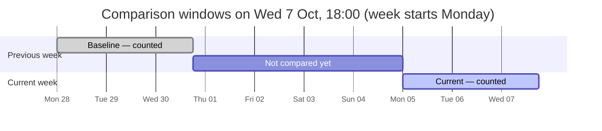
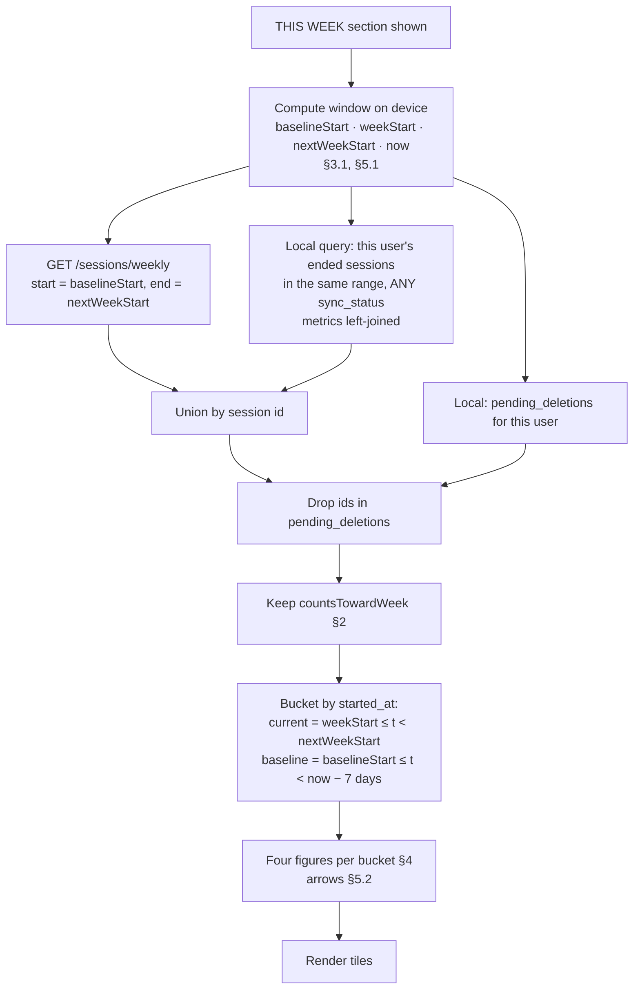

# Eleven — Weekly Stats System Design Spec (Feature 0.7)

**Status:** Draft v2
**Milestone:** M0
**Feature:** 0.7 — Weekly stats
**Depends on:** 0.4 (GPS tracking & sync), 0.5 (post-session summary), 0.6 (session history)
**Contains amendments to:** 0.6 **[0.6 correction]**
**v2 changes:** the week always starts on Monday. The device's first-weekday setting is no longer read (§3.1).

---

## 1. Scope

0.5 produces one session's numbers. 0.6 lists those sessions. 0.7 turns them into **a week**: four figures that say how much football the player has played since the week began, and whether they are ahead of or behind where they were at the same point last week. It is the PRD's habit signal. The success metric is 2+ sessions a week for 4 consecutive weeks, and this is the screen element that makes that rhythm visible to the player.

**This spec owns:**
- Which sessions count toward a week, and which do not (§2)
- Where a week starts and ends, and how a session is placed in one (§3)
- The four figures and how each is computed (§4)
- The comparison with the previous week (§5)
- Merging the server and the device into one exact set of sessions (§6)
- The "THIS WEEK" section on the home screen (§7)
- The read endpoint behind it (§9)

**This spec does not own:**
- Computing any per-session metric, or the data-quality and suppression rules (0.5 §3, §5)
- Sync, retry, deletion outboxes, or the `finalize` transport (0.4 §8–§10, 0.6 §7)
- The rest of the home screen: the Start Session action (0.3), the last-session card, and the streak (§15)

**Explicitly out of scope for M0:**

| Item | Why |
|---|---|
| Charts, trends, or any history of past weeks | The PRD says an up/down arrow is enough. One week and its comparison is the whole feature |
| A sprint figure of any kind | Refused for M0 (0.6 §8). None of the PRD's four figures is a sprint figure |
| Calories, top speed, or zones as weekly figures | Not in the PRD's list. Top speed is a maximum, not a total, and doesn't belong in a rollup of volume |
| A type filter on the weekly figures | Weekly stats are about the habit, across every kind of football. History is where filtering lives |
| Notifications or reminders about the week | M0 has none. The success metric is measured *without* reminders |
| Goals or targets ("3 sessions this week") | M3 territory (Project X, streaks) |

---

## 2. What counts toward a week

**A session counts if it has ended, has metrics, and its `data_quality` is not `insufficient`.** Every one of the four figures is computed over that same set.

| Session state | Counts? | Why |
|---|---|---|
| Ended, metrics present, `good` | **Yes** | The normal case |
| `estimated` | **Yes** | The numbers are conservative, not wrong (0.5 §3.3). Distance is biased low and the session still happened |
| `speed_source = none` | **Yes** | Distance and active duration are unaffected (0.5 §5.1). Average speed needs no speed field, since it is distance ÷ duration |
| `insufficient` | **No** | See below |
| Finalized **without** metrics | **No** | See below |
| Unsynced on this device — `pending`, `syncing`, `failed`, `rejected` | **Yes**, under the rules above | Metrics are computed before sync starts (0.5 §2). The session the player finished this morning has to count this morning |
| Kicked off, still live | **No** | Not over. It counts the moment it ends and its metrics are written |
| Deleted, or in `pending_deletions` | **No** | Deleted means gone everywhere (0.6 §7.1), including from the week |

**Why `insufficient` sessions don't count.** 0.5 §5.2 refuses to show an `insufficient` session's numbers as measurements. A weekly total is still a presentation of those numbers, just summed. Adding the distance from 30 seconds of usable signal into "14.2 km this week" would turn an unusable figure into one that looks trustworthy.

**Why they don't count as sessions either.** The four figures describe one set of sessions. "3 sessions · 14.2 km · 186 min" should mean that those three sessions produced that distance in that time. If a session were counted but its numbers weren't, the figures would describe different sets, and the average speed would sit next to a session count it didn't come from. Sessions without metrics are excluded for the same reason, and they are only ever pre-0.5 leftovers anyway (0.6 §4.5.2).

**Accepted consequence: weekly stats and history can disagree about a session.** An `insufficient` session fills its day on the 0.6 grid and is in the history count, but it isn't in "sessions this week". The two answer different questions. History records what was played. Weekly stats total what was measured. No copy explains the gap in M0. If testers read it as a bug, the fix is a caption, not a change to the rule (§15).

**One predicate, in one place.** Whether a session counts is decided by **one client function**, `countsTowardWeek(session)`, applied to the server's rows and the device's rows alike (§6.3). It sits next to the shared presentation function from 0.6 §4.4 and follows the same reasoning: two copies of a rule eventually disagree.

---

## 3. The week

### 3.1 Boundaries come from the device

All timestamps on the server are UTC. `timestamptz` stores an absolute instant, so "which week" has no answer until a timezone and a week-start day are chosen. **The timezone comes from the phone. The week always starts on Monday.**

- **Timezone:** the device's current IANA timezone, as 0.6 already uses for the month grid (0.6 §4.2.2).
- **First day of the week:** **Monday, for every user.** It is not read from the device's regional setting. Monday is the PRD's default and the convention in the launch market. One fixed rule also means nothing on the device needs to be read, and two players in the same group always agree on what "this week" means.

**A week runs from Monday 00:00 local time to the following Monday 00:00 local time.** "Seven calendar days", not 168 hours: in timezones with daylight saving, a week that contains a clock change is 167 or 169 hours long. The boundary arithmetic is done in local calendar terms, never by adding a fixed number of milliseconds.

**A session belongs to the week its `started_at` falls in.** This is the same rule 0.6 uses for grid days and titles. A Sunday 23:30 kickoff counts entirely in the week that is ending, including its distance from after midnight. A session is never split across two weeks, because no one remembers a game that way.

**The client computes the boundaries and sends the server UTC instants (§9).** The server never needs to know about timezones or daylight saving for this feature. It runs a range scan over `started_at`. This differs from 0.6's calendar endpoint, which sends `tz` and lets the server bucket by day. The difference is deliberate: the client has to bucket the local rows itself anyway (§6), and splitting the week arithmetic across two places would give it two definitions.

**Travel caveat, inherited.** No session stores the timezone it was played in (0.6 §4.2.3). A session played late on a Sunday in Lagos and viewed from somewhere a few hours ahead can move into the next week. This is accepted for M0, and it is consistent with the grid, row dates, and titles, which all shift the same way.

### 3.2 Nothing resets

The PRD's "reset every Monday" needs **no reset mechanism**. There is no stored weekly total, no counter, and no scheduled job. The figures are derived from the sessions each time they are shown, so on Monday 00:00 the current window simply contains no sessions yet. This follows the project's derive-don't-store rule, and it means there is nothing to get out of sync when a session is deleted, synced late, or recorded on another phone.

---

## 4. The four figures

Over the sessions that count (§2) and fall in the window (§3):

| Figure | Formula | Display |
|---|---|---|
| **Sessions** | count of sessions | Integer. "1 SESSION" / "4 SESSIONS" where a label carries the noun |
| **Distance** | Σ `distance_m` | km, at the shared formatter's precision (0.6 §4.4) |
| **Time played** | Σ `active_duration_seconds` | Whole minutes, rounded to nearest |
| **Average speed** | Σ `distance_m` ÷ Σ `active_duration_seconds` | km/h, one decimal. "—" when no session counts |

**Time played is active duration.** Breaks are excluded, added and extra time are included, and only `manual` pauses subtract (0.5 §3.2). It is the same figure the summary calls duration, summed.

**Average speed is a ratio of sums, not a mean of averages.** Two sessions, 8 km in 80 minutes and 1 km in 20 minutes, give 9 km over 100 minutes = **5.4 km/h**. A mean of their averages, (6.0 + 3.0) ÷ 2, gives 4.5, which weights a 20-minute kickabout the same as a full match. The ratio of sums is also the only form consistent with 0.5 §3.4: it is exactly the average speed of the week as if it were one long session, so the displayed distance and time reconcile with it, which is the property 0.5 chose that definition for. Nothing stores an average speed (0.5 §6.1), so there's nothing to reuse here. It is one division at render time.

**Sums are computed in raw units and rounded once, at display.** Summing already-rounded per-session values would let the weekly distance drift from the sum of the rows a player can see in history.

**No `estimated` marker on weekly figures.** A week that includes any `estimated` session is conservative, not wrong. Marking the total would put a badge on most weeks for players with mid-range phones, and it would say nothing actionable. Each underlying session still carries its own marker in history and on its summary.

---

## 5. Comparison with the previous week

### 5.1 The baseline is the same point last week

**Decision: each figure is compared with the previous week *up to the same moment*: the same weekday and the same local time, seven calendar days ago.** It is not compared with the whole previous week.



The PRD asks for a comparison to the previous week, but doesn't say against what. Comparing a partial week with a whole one gives an answer that is wrong most of the week:

| Day | Played this week | Played last week (whole) | Full-week comparison says | Same-point comparison says |
|---|---|---|---|---|
| Mon 09:00 | — | 2 sessions | ↓ every figure | No arrows: nothing to compare yet |
| Thu 20:00 | 1 session | 2 sessions (Tue, Sat) | ↓ | Level on sessions: one each by Thursday evening |
| Sat 19:00 | 2 sessions | 2 sessions | Level | Level, or ↑/↓ on distance and time |

For a player who plays every week, the full-week comparison shows down arrows from Monday until the weekend. That tells them they are falling behind exactly when they are on track. For a product whose only job in M0 is to reinforce a habit, it is the wrong signal. The same-point comparison asks the question a player actually has in mind: *am I ahead of where I was at this point last week?*

By Sunday night the baseline covers almost the whole previous week, so the two methods converge as the week ends.

**Rejected: full previous week.** It is simpler to explain, but it shows a misleading arrow for most of every week, as above.
**Rejected: last completed week vs the one before it.** It stays stable all week, but then "this week" isn't live. A session played today wouldn't change anything on the home screen until next Monday, which defeats the point of showing it.

### 5.2 Arrow rules

Per figure, comparing the current window with the baseline window (§5.1):

| Baseline | Current | Indicator |
|---|---|---|
| Zero or undefined | Zero or undefined | **None.** There is nothing to compare, and a "level" marker would claim a comparison happened |
| Equal to current at display precision (§5.3), non-zero | Same | **Level** |
| Lower | Higher | **Up** |
| Higher | Lower | **Down** |
| Zero | Non-zero (sessions, distance, time) | **Up** |
| Undefined (average speed) | Defined | **None.** Average speed has no baseline when last week had no counting session by this point |
| Defined (average speed) | Undefined | **None.** Same reason, the other way round |

Sessions, distance, and time are never undefined. Zero is a real value for them. Average speed is undefined when its window has no counting session, and it never compares against an undefined value.

**A down arrow is neutral, not alarming.** Down is drawn in the secondary text colour, not a warning colour, and up uses the brand accent. A quiet week is information, not a failure, and M0 is about getting a player to come back, not about telling them off. (M3's streak grace rules take the same stance, PRD 3.4.)

### 5.3 Compared at display precision

Values are compared **after rounding to the precision they are displayed at**: whole sessions, the formatter's distance precision, whole minutes, and 0.1 km/h. Otherwise 6.81 against 6.79 km/h shows an up arrow beside two figures the player would read as the same. The arrow should never contradict what the numbers look like.

### 5.4 The baseline moves with the clock

Because the baseline ends at *now minus seven days*, it grows as time passes, and an arrow can change without the player doing anything. If last Saturday's match kicked off at 10:00, then at 10:00 this Saturday the baseline gains that session, and a sessions arrow that read *up* can turn *level* while the app is closed. That is correct, since the player has fallen level with last week by that point. The figures are recomputed whenever the section is shown (§6.6), so it is never stale on screen.

---

## 6. Two sources, one exact set

### 6.1 Server window plus every local session in the window

As 0.6 §3.1 sets out, a finished session lives on the server, on this device, or both. 0.7 needs an **exact** set, because it sums numbers rather than listing rows, and a session counted twice inflates three of the four figures.

**Decision: the server returns the individual sessions in the window, not totals, and the client unions them with local sessions by id.** Because both sources return per-session rows with shared ids (issued at 0.3 setup), de-duplication is exact, in the same way the month grid merges by id (0.6 §4.2.2).



**The local query includes synced sessions, not just unsynced ones.** This is where 0.7 differs from 0.6's local source, which reads only unsynced rows (0.6 §3.1). At sync, 0.4 deletes only the full-resolution trace. The `tracking_sessions` row and its metrics stay on the device (0.6 §9.2). Reading every local session in the window has two benefits, and with union by id it costs nothing:

- **It closes a refresh race.** When a session reaches `synced`, it leaves 0.6's local source. If the cached server response is from before that session's `finalize`, the session briefly appears in neither source until the server refetch returns. In a list, that is a row flickering. In a total, it is the week's distance dropping and coming back. Reading the synced local copy as well means the session is never missing from both.
- **Offline is nearly complete.** For a player on one phone, every session in the last two weeks is on the device. Only sessions from another phone or from before a reinstall depend on the server.

When both sources have a row for the same id, the metrics are identical, because they are immutable (0.5 §2). Either row can be used. The local row is used for consistency with 0.6 §3.2.

### 6.2 Pending deletions

Ids in the user's `pending_deletions` are removed from the server rows before summing. Deleting a session locally already removes its local rows in one transaction (0.6 §7.2). So a session deleted offline leaves the week immediately, even while a cached server response still contains it, which matches what 0.6 guarantees for the list, count, and grid.

### 6.3 One predicate, applied after the merge

The server returns every **ended** session in the range, with metrics when they exist (§9). It does not filter on `data_quality` or on whether metrics exist. `countsTowardWeek` (§2) runs on the client, once, over the merged set.

This puts the rule in exactly one place. If the server filtered as well, the rule would exist in Python and in TypeScript, and the first change to it, such as M3 deciding something about `estimated`, would have to be made in both. The cost is a few rows the client discards, and a two-week window has a handful at most.

### 6.4 No `finalize`-acknowledgement rule

0.6 §15 says 0.6's `finalize`-acknowledgement rule applies to 0.7's session count. **With per-session rows, it doesn't.** That rule exists because 0.6's count adds a server **total** to a number of local rows. The device has to know which local sessions the server is already counting, and `finalized_at` is how it knows (0.6 §4.2.1). 0.7 never receives a total. It receives the sessions, so a session in both sources is counted once by id, whatever its `finalized_at`. `countsTowardWeek` doesn't read `finalized_at` or `sync_status`. The 0.6 note is corrected in §12.

### 6.5 Scoped to the signed-in user

Every local read, sessions and `pending_deletions`, filters on the current user's id (0.6 §3.4). The query key includes the user id. A phone that switches accounts never shows one player's week to another.

### 6.6 Refresh and invalidation

**The weekly queries live under 0.6's history query-key namespace** (`['session-history', 'weekly', userId, weekStartKey]`). That is all the invalidation wiring 0.7 needs. Everything that already refreshes or clears history also covers the week:

- `invalidateHistory()`: the sync worker calls it on every sync-field change, and the delete mutation calls it on success.
- `clearHistoryCache()`: called on sign-out.

**The section recomputes whenever Home gains focus and when the app returns to the foreground.** This covers three cases that no event signals: a session synced from another phone, a week boundary passing while the app was in the background, and the moving baseline (§5.4). No timer is set for the week rollover. A Home screen left open in the foreground across Sunday midnight shows last week until the next focus, and that is acceptable.

**A just-finished session appears on return to Home.** Ending a session writes its local metrics before anything else (0.5 §2). Going back to Home from the summary is a focus event, so the section re-reads local storage, which takes no network round trip, and the session counts at once, online or not.

### 6.7 Offline and cold cache

The client cache is **in memory only**, as in 0.6 §3.5.

| Situation | What the section shows |
|---|---|
| Server response in cache (fresh or stale) | Figures and arrows from the merge, revalidating in the background |
| No cache, request in flight | Loading state (§11) |
| No cache, server unreachable | **Dashes in all four tiles, no arrows**, plus a small "Offline" note. Retries on reconnect and on next focus |

**Why it doesn't fall back to local-only figures.** A partial list looks partial. A partial total looks complete. After a reinstall, local storage is empty, and local-only figures would show "0 sessions" with confidence, which is a wrong number presented as a measurement, the failure 0.5 exists to prevent. With a cache in place, local changes still merge on top, so the session just played still counts. The dash state only appears on a cold start with no network.

### 6.8 Considered and rejected: server-side aggregation

The alternative was for the server to return the two weeks' totals, with the client adding unsynced local sessions and subtracting pending deletions.

It's a smaller response, but it only works if the client knows exactly which sessions the server's totals already include. That means relying on `finalized_at` again, plus a race between the cache and sync. Subtracting a pending deletion's distance and duration would also mean storing metrics on `pending_deletions`, a table that is meant to hold ids only. It would also put week arithmetic on the server, giving the week two definitions. For a payload of a handful of rows, none of that is worth it. Rejected.

---

## 7. The home screen section

### 7.1 Where it lives

The home screen already has a **THIS WEEK** section below the fold: three `StatTile`s (Sessions, Distance, Minutes) fed by mocked `weeklyStats` in the Home route. This matches the M0 design prompt ("current weekly stats as secondary content below the fold"). 0.7 makes it real and changes it in two ways:

- **A fourth tile, average speed.** The PRD's list has four figures and the current section has three. Four tiles in a single row, each with an arrow, will be tight on a narrow phone. A 2 × 2 grid is the likely layout. The final layout is a design decision (§11).
- **An arrow on each tile, and a one-line caption** that says what the arrow compares with.

| Tile | Label | Value | Unit |
|---|---|---|---|
| Sessions | SESSIONS | `4` | — |
| Distance | DISTANCE | `27.1` | KM |
| Time played | MINUTES | `312` | MIN |
| Average speed | AVG SPEED | `5.2` | KM/H |

**Caption (draft):** "vs this point last week". The same-point baseline (§5.1) is the less obvious reading of "previous week", so it has to be stated, or a Wednesday down arrow will be read against last week's full total. The caption is hidden when no tile shows an arrow.

### 7.2 Never in the way of Start Session

The PRD's north star is that Start Session is the most obvious thing in the app. The weekly section is **secondary in every respect**:

- Start Session renders without waiting for weekly data. The section loads independently.
- The section reserves its height while loading, so arriving data never shifts the layout above or around it.
- The section has no tap action in M0. Tapping a tile does nothing. If a target is ever wanted, history is the obvious one, but that is not M0.

### 7.3 Accessibility

Each tile reads as one element, with the comparison spoken in words: "Distance, 27.1 kilometres, up from 22.4 at this point last week." Arrows are never the only carrier of meaning. The direction is in the label, and up and down differ in shape, not just colour. The baseline values are already computed for the arrows, so speaking them costs nothing.

---

## 8. Data model

**No new state, on either side.** No column, no table, no index, no cache table, no scheduled job. 0.7 reads `sessions` and `session_metrics` on the server, and `tracking_sessions`, the local `session_metrics`, and `pending_deletions` on the device, all of which exist after 0.6.

**Server:** the range scan uses 0.6's index as it is.

```sql
-- exists since 0.6 §9.1
CREATE INDEX ix_sessions_user_started
    ON sessions (user_id, started_at DESC, id DESC)
    WHERE ended_at IS NOT NULL;
```

The partial predicate matches §9's `ended_at IS NOT NULL`, and the leading `(user_id, started_at)` columns serve the range directly. `session_metrics.session_id` is unique (0.5 §6), so the join needs nothing new.

**Device:** one new read, alongside 0.6's local history query:

```
getLocalSessionsInRange({ userId, start, end })
  → tracking_sessions
      WHERE user_id = :userId
        AND ended_at IS NOT NULL
        AND started_at in [start, end)        -- compared as instants, see below
    LEFT JOIN session_metrics ON session_id
  -- any sync_status (§6.1)
```

`started_at` is stored as ISO-8601 text. The range comparison has to be made **as instants**. A plain string comparison is only correct if every stored value is normalised to the same UTC `Z` form, and a value written with a local offset would compare wrongly. If normalisation can't be guaranteed, filter after parsing. The local table holds at most a few hundred rows, so a scan is fine and no index is needed.

**One pure function owns the arithmetic**, in the pattern of 0.6's `merge-history.ts`, so all of §2–§6 can be unit-tested without a device:

```
buildWeeklyStats({
  serverItems, localRows, deletions,
  now, timeZone,
}) → {
  current:  { sessions, distanceM, activeSeconds, avgSpeedKmh | null },
  baseline: { sessions, distanceM, activeSeconds, avgSpeedKmh | null },
  arrows:   { sessions, distance, time, avgSpeed }   // 'up' | 'down' | 'level' | null
}
```

---

## 9. API surface

No `/v1` prefix, per the project's API conventions.

| Method & path | Purpose |
|---|---|
| `GET /sessions/weekly` | The current user's ended sessions that started in `[start, end)`, with the metrics weekly stats need |

**Query parameters:**

| Param | Type | Rule |
|---|---|---|
| `start` | ISO-8601 instant **with offset** | Inclusive |
| `end` | ISO-8601 instant **with offset** | Exclusive |

`422` if either is missing or naive (no offset), if `start >= end`, or if `end − start` exceeds **15 days**. The client asks for the baseline week's start through the current week's end: two weeks, plus up to an hour for a daylight-saving change. The cap keeps the endpoint from turning into an unbounded history export, and it keeps the response small without pagination.

**Response:**

```
WeeklySessionWindow
  start
  end
  items:
    - id
      started_at
      metrics:                       # null when finalized without metrics
        active_duration_seconds
        distance_m
        data_quality                 # 'good' | 'estimated' | 'insufficient'
```

```sql
SELECT s.id, s.started_at,
       m.active_duration_seconds, m.distance_m, m.data_quality
FROM sessions s
LEFT JOIN session_metrics m ON m.session_id = s.id
WHERE s.user_id   = :user_id
  AND s.ended_at  IS NOT NULL
  AND s.started_at >= :start
  AND s.started_at <  :end
ORDER BY s.started_at DESC, s.id DESC;
```

- **No filtering beyond "ended".** `countsTowardWeek` runs on the client (§6.3).
- **No aggregation on the server.** The response is rows, so the client can merge them by id (§6.1).
- **Only the caller's sessions.** There is no session id in the path, so ownership is the `user_id` predicate, and there is no `404` case.
- **`speed_source` isn't returned.** No weekly figure depends on it (§2).

Pydantic schemas: `WeeklySessionWindow`, `WeeklySessionItem`, `WeeklySessionMetrics`, following the existing read-schema pattern.

---

## 10. Performance

The PRD sets no target for weekly stats. This spec sets one, because the section sits on the most-visited screen in the app.

**Target: the section's figures render within 2 seconds of Home mounting, on a cold cache, without delaying Start Session.** This mirrors 0.6 §11's history target.

| Stage | Budget | Why it fits |
|---|---|---|
| Window computation | < 5 ms | Date arithmetic |
| Local range query + deletions | < 100 ms | A few hundred rows at most, scanned once |
| Server range query | < 50 ms p95 | One index range scan over two weeks, plus a one-to-one join |
| Network round trip | ~1 s allowance | Ten-odd rows, well under 2 KB |
| Merge, bucket, sum | < 5 ms | Ten-odd rows |

The local and server reads run **in parallel**. The section doesn't depend on any of 0.6's history reads, and Home doesn't trigger them.

**Acceptance test conditions:** the 0.6 seed account (200 sessions, every sync state and `data_quality`), plus sessions placed deliberately at week boundaries: Sunday 23:59 and Monday 00:00 local, sessions on both sides of a daylight-saving change in a DST timezone, and a session in the baseline window a few minutes after *now − 7 days*. Run on a budget-class Android device, throttled network, cold cache.

**Unit cases for `buildWeeklyStats`, at minimum:**
- A session present in both sources counts once.
- A pending deletion present in the server rows is excluded.
- `insufficient` and no-metrics sessions are excluded from all four figures.
- `estimated` and `speed_source = none` sessions are included.
- Average speed is a ratio of sums (the §4 example gives 5.4, not 4.5).
- Sunday 23:30 kickoff → previous week. Monday 00:00 → current week.
- A session in last week at *now − 7 days + 1 minute* is not in the baseline.
- Both windows empty → no arrows. Baseline zero, current non-zero → up.
- 6.81 vs 6.79 km/h → level.
- On any weekday, `weekStart` is the most recent Monday 00:00 local, and on a Monday it is that same day.

---

## 11. Design states to mock

The current home mockup shows three tiles with values and no comparison. Each state below maps to a rule in this spec. Mock in **both light and dark themes**.

| State | What the section shows | Rule |
|---|---|---|
| Four tiles, final layout (likely 2 × 2) | Sessions, Distance, Minutes, Avg speed with units | §7.1 |
| Arrows: up, down, level, and none, mixed across tiles | Down in a neutral colour, up in brand accent, shapes distinct | §5.2, §7.3 |
| Comparison caption | "vs this point last week", hidden when no arrows show | §7.1 |
| New user, zero sessions ever | 0 · 0.0 · 0 · —, no arrows, no caption. Must feel intentional, not empty (design prompt) | §5.2 |
| Monday morning | Zeros, no arrows. Not a row of down arrows | §5.1 |
| Average speed undefined | "—" in the tile, no arrow | §4, §5.2 |
| Loading, cold cache | Placeholder holding the section's final height | §7.2 |
| Offline, no cache | Dashes, no arrows, "Offline" note | §6.7 |
| Large values | 3-digit minutes, 2-digit distance, without truncation | §7.1 |

---

## 12. Amendments to earlier specs

### 12.1 **[0.6 correction]**

**§15, 0.7 note — replace with:**

> **0.7 (weekly stats)** reads from both sources, as §3 does, but differently. It fetches the server's sessions in a two-week window, unions them with **every** local session in that window, synced or not, by id, and removes pending deletions. Because it merges individual rows rather than adding a server count, it doesn't use the `finalize`-acknowledgement rule (§4.2.1). A session counts only if it has metrics and is not `insufficient`, so weekly "sessions" can be lower than the history count for the same days. Weekly average speed is Σ distance ÷ Σ active duration. No sprint figure, per §8. See 0.7 §2, §6.

The v3 wording said the `finalize`-acknowledgement rule applies to 0.7's session count. That only holds if 0.7 adds a server total to local rows, and 0.7 §6.8 rejects that design.

---

## 13. Tuning parameters

| Parameter | Value | Rationale |
|---|---|---|
| Week start | Monday 00:00 local, fixed | PRD default and the launch market's convention. Revisit only if Eleven launches where weeks start on Sunday and testers find Monday wrong |
| Comparison baseline | Same weekday and local time, 7 calendar days earlier | §5.1. Revisit if testers read arrows against last week's full total despite the caption |
| Comparison precision | Display precision per figure | §5.3 |
| `GET /sessions/weekly` max span | 15 days | Two weeks plus DST slack. Bounds the response without pagination |
| Revalidation | On Home focus and app foreground; on every `invalidateHistory()` | §6.6 |
| Client cache | In memory only | Same as 0.6 §3.5 |
| Time-played unit | Whole minutes | Matches the existing tile. Switch to h:mm only if real weeks regularly pass ~600 minutes |

---

## 14. Notes for adjacent specs

- **M3 streaks.** A weekly streak needs the same week definition, and it should reuse this spec's boundary rule rather than define a second one. But streak-at-risk notifications are sent from the **server**, which doesn't have the device timezone (§3.1). The Monday start is fixed, so it's no problem, but M3 will have to store the timezone per user, as the user's current setting, and decide what a streak means for a player who travels. That decision belongs to M3. 0.7 deliberately keeps the timezone on the device.
- **M3 career stats.** "Accurate against the sum of underlying session records" (PRD 3.5) needs an eligibility rule. 0.7's (§2: metrics present, not `insufficient`) is the precedent. If M3 adopts it, `countsTowardWeek` should become a shared `countsTowardTotals`, still in one place. Career stats will be server-side, so that rule will then need a single backend definition too. Settle where it lives at that point.
- **M3 trust.** Weekly figures are as client-computed and as spoofable as every other metric (0.5 §10). That is harmless while they are private, and becomes a problem when they turn public or competitive.
- **0.8 (share card).** A "my week" share card is an obvious extension. If one is added, it should take its numbers from `buildWeeklyStats` and show the comparison caption, or a down arrow will be screenshotted without context.
- **Deletion.** Nothing derived from sessions is stored (§8), so deleting a session needs no extra handling here. 0.6 §15's warning about derived artefacts doesn't apply to 0.7.

---

## 15. Open items

| Item | Status |
|---|---|
| `insufficient` sessions missing from weekly sessions but present in history (§2) | Accepted. Watch for testers reading it as a bug, and add a caption if they do |
| Four-tile layout | Design decision. 2 × 2 expected (§7.1, §11) |
| Caption and accessibility copy (§7.1, §7.3) | Draft; to go through a UX copy pass with 0.6's copy |
| **Last-session card on Home** | Not owned by any spec, and currently mocked. It can be built from 0.6's merged history (newest entry) with no new API. Assign it to 0.6 as a follow-up or treat it as a small standalone task |
| **Streak on Home** | Currently mocked ("18"). Streaks are M3. The element should be hidden in M0 rather than show a fabricated number |
| 0.6 amendment in §12 | Applied in 0.6 §15 |
